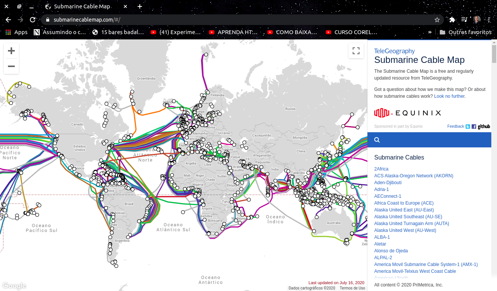
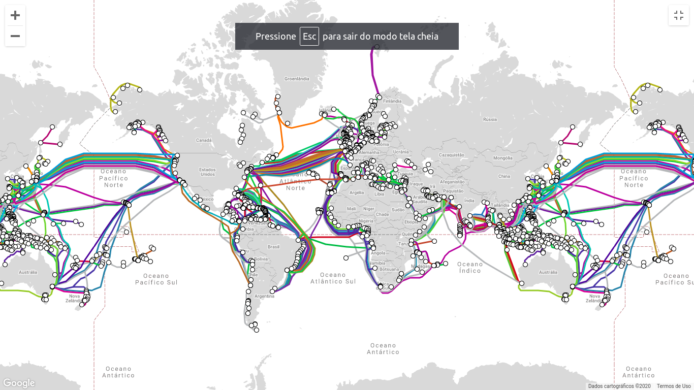

# História da Internet 

Surgiu na década de nos Estados Unidos, na época da guerra fria, a partir de uma rede de informações militares que interligava centros de comando e de pesquisa bélica.

Ela surgiu para atender uma necessidade militar de proteger os sistemas de defesa do pais no caso de um ataque nuclear.

Nos anos 80 ela foi adquirido por diversas universidades públicas e companias privadas. As várias tecnologias que suportam a internet se acoplaram através do tempo, mas a forma de funcionamento não mudou muito. Internet é uma forma de conectar os computadores e garantir, em qualquer situação, sempre encontrem uma maneira de se manter conectados.

# O que é a internet 

A internet é um conjunto de redes de computadores que, espalhados por todas as regiões do planeta, conseguem <strong>trocar dados e mensagens utilizando um protocolo comum.</strong>

Este protocolo que é compartilhado pela internet é capaz de unir:
- Usuários particulares
- Entidades de pesquisa
- Òrgãos culturais
- Institutos militares
- Bibliotecas e empresas de todos os tipos em um mesmo acesso.

Então ela é formada por computadores comuns e por outros especiais, chamados de servidores, que são máquinas com grande poder de processamento e conexões velozes. Os servidores são controlados por universidades, empresas e órgãos do governo.

A internet também traz uma extensa gama de vários recursos de informação e serviços, como os documentos inter-relacionados a hipertextos da World Wide Web (WWW), redes e infraestrutura de apoio a correios eletrônicos e e-mails.

A internet também possui um alcance e uma abrangência, podendo auxiliar inclusive mídias eletrônicas e impressas, uma vez que uma informação é acessada de qualquer lugar do mundo e a qualquer hora, por uma única pessoa.

# Como funciona a internet 

Apresisamos entender que a internet é dividida em 2 partes principais, o HARDWARE e o SOFTWARE.

Hardware são os cabos de fibra ótica que interliga todos os continentes globo terrestre. 

Software é o responsável pelo gerenciamento dos dados, e vai garantir que eles cheguem com segurança.

A internet é uma interligação de vários dispositivos conectados no mundo todo. Quando conectamos vários computadores um aos outros, criamos uma rede de internet local. Agora para essa internet ter acesso global, precisamos interligar a uma rede ainda maior, ou seja, é uma interligação de redes. 

Então você pode estar se perguntando, como que essa interligação é feita ? A resposta é simples, por meio de milhares de cabos submarinos de fibra ótica. Eles percorrem aproxidamente cerca de 17 mil 800 kilómetros no fundo do mar.

Se você quizer saber mais em tempo real a quantidade de cabos submarinos, que existem atualmente no mundo.

Acesse esse link para para mais informações: [Submarinecablemap](<https://www.submarinecablemap.com/>) 

# Como que são feitos essas ligações ? 

## Uma rede simples

Para tornar a rede de computadores imune a ataques foi usada a tecnologia de transmissão de dados por comutação de pacotes – packet switching. Para entender essa tecnologia imagine a existência de três computadores instalados em três prédios diferentes conectados entre si através de linhas telefônicas. O computador A está ligado no computador B, o computador B está ligado ao computador C e o computador C está ligado ao computador A. Se o computador A deseja enviar uma nota para o computador C utiliza-se a rota AC. Caso exista um bloqueio na rota AC através dessa tecnologia é possível enviar a nota pela rota ABC. Como existem milhares de rotas na Internet a chance de paralisação total da rede é muito pequena.

Para que a rede possa funcionar é necessário procedimento detalhado para a troca de dados. As regras são implementadas através de “protocolos de comunicação”. As regras de comunicação entre computadores são similares as de uma linguagem humana. Por exemplo, quando se estabelece uma conversa entre duas pessoas a etiqueta diz que enquanto uma fala a outra escuta; para que uma idéia seja transmitida é necessário colocar as palavras dentro de uma sintaxe da língua conveniente; caso o interlocutor não entenda a mensagem ele solicita que seja repetida. Para a troca de mensagens na Internet foi desenvolvido o protocolo de comunicação TCP/IP – Transmission Control Protocol/Internet Protocol. O protocolo IP é responsável por dividir uma mensagem em vários pacotes compatíveis com a rede e encaminhá-los ao computador com um determinado endereço na Internet. O protocolo TCP é responsável por manipular uma quantidade grande de dados e garantir que as informações transmitidas entre dois computadores da rede não contenham erros.

Com ❤ <strong>Daniel Developer</strong>